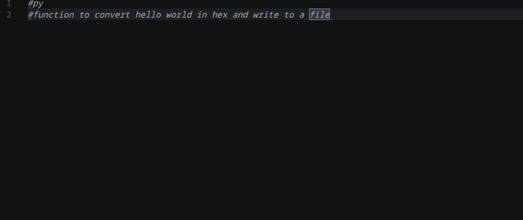

  

# Collama

**AI-powered code completion and editing for VS Code using local LLM backends**

[Features](#features) • [Installation](#installation) • [Configuration](#configuration) • [Models](#models) • [Contributing](#contributing)

  

---

## Overview

Collama is a VS Code extension that uses local LLM backends to get code completions, refactoring suggestions, and documentation generation — all running privately on your machine with no external API calls. Supports [Ollama](https://ollama.com) and OpenAI-compatible API (verified only [vLLM](https://docs.vllm.ai/)).

> **Status:** This project is in heavy active development. For sure there will be a lot of strange output. If you have any ideas to improve the quality just let me know and contribute!

## Features

**Code Completion**
- Inline, multiline, and multiblock (more a "fun" feature) suggestions
- Uses currently opened tabs as context

**Code Edits**
- Generate docstrings and documentation
- Extract functions and refactor code
- Simplify complex code
- Fix syntax errors
- Manual instructions

**Chat Interface**
- Chat with multiple sessions - organize conversations by topic
- Send selected code or files to chat as context
- Context is automatically attached to messages with file reference and line numbers
- Real-time context usage bar showing token consumption vs model's context window
- Automatic context trimming — when conversations exceed the context window, older messages are removed from the LLM context while remaining visible in the chat
- Visual indicators for messages no longer included in the LLM context

**AI Agent with Tool Calling**
- LLM can interact with your workspace through function calling
- **File System Tools**: Read files, list directories, search contents with regex, create files and folders, edit files with diff preview
- **Git Tools**: Browse commit history, compare branches, view diffs, list branches
- **Security**: Path traversal protection, workspace boundary enforcement, .gitignore integration
- **Real-time Feedback**: Tool calls streamed to chat as they execute
- The agent can autonomously explore your codebase to provide context-aware assistance

**Commit Messages**
- AI-generated conventional commit messages from staged changes
- Analyzes git diff to create meaningful commit descriptions
- Accessible via command palette or Source Control view

**Context Management**
- Automatic detection of the model's context window size (Ollama and OpenAI)
- Prompts that exceed the context window are blocked with a clear notification
- Open editor tabs are used as additional context for completions, with smart pruning to fit the context window

## Quick Start

### Prerequisites

- **VS Code** 1.109.0 or higher
- **Ollama** running locally (or accessible on your network), or any OpenAI-compatible API
- A supported code model (see [Models](#models))

## Installation

Use the marketplace to install the extension or build the vsix yourself. Furthermore you need an `ollama` instance in your local network. 
See [this link how to install ollama](https://docs.ollama.com/quickstart) or [this link for the docker image](https://ollama.com/blog/ollama-is-now-available-as-an-official-docker-image).

Alternatively, you can use [vLLM](https://docs.vllm.ai/) (tested). Point the endpoint settings to your server and the backend is auto-detected. If authentication is required, see [Bearer Tokens](#bearer-tokens-optional).

## Configuration

Configure Collama via VS Code Settings (Preferences → Settings, search "collama"):

| Setting                         | Type    | Default                     | Description                                              |
| ------------------------------- | ------- | --------------------------- | -------------------------------------------------------- |
| `collama.apiEndpointCompletion` | string  | `http://127.0.0.1:11434`    | Endpoint for code auto-completion                        |
| `collama.apiEndpointInstruct`   | string  | `http://127.0.0.1:11434`    | Endpoint for code edits/chat                             |
| `collama.apiCompletionModel`    | string  | `qwen2.5-coder:3b`          | Model for code completions                               |
| `collama.apiInstructionModel`   | string  | `qwen2.5-coder:3b-instruct` | Model for code edits (use instruct/base variant)         |
| `collama.autoComplete`          | boolean | `true`                      | Enable auto-suggestions                                  |
| `collama.suggestMode`           | string  | `inline`                    | Suggestion style: `inline`, `multiline`, or `multiblock` |
| `collama.suggestDelay`          | number  | `1500`                      | Delay (ms) before requesting completion                  |

### Bearer Tokens (Optional)

If your API endpoints require authentication (e.g. vLLM with `--api-key`, or a reverse proxy), you can securely store bearer tokens using VS Code's encrypted credential storage. Tokens are sent as `Authorization: Bearer <token>` headers with every request.

1. Open the Command Palette (`Ctrl+Shift+P` / `Cmd+Shift+P`)
2. Run one of these commands:
   - `collama: Set Bearer Token (Completion)` - for the completion endpoint
   - `collama: Set Bearer Token (Instruct)` - for the instruct/chat endpoint
3. Enter your token in the password input (characters will be masked)
4. The token is stored encrypted in your system's credential manager

**Note:** Tokens are stored securely and never appear in plain text in your settings or configuration files. To clear a token, run the same command and leave the input empty.

## Models

### Recommended Models

Collama is tested primarily with the **Qwen Coder** for Completion and ***gpt-oss** for Instruction.

#### For Code Completion (FIM - Fill In Middle)
- **any qwen coder > 3b** recommended
- **qwen2.5-coder:7b** (stable quality)

#### For Code Edits (Instruct/Base Models)
- **any instruct model and thinking** recommended
- **gpt-oss:20b** (stable quality)
Do not use a FIM model for instructions. It will produce very poor quality answers.

### Openai SDK was tested with glm-4.7-fp8 for instructions giving superior responses

### Model Completion Compatibility Table

| Model         | Tested Sizes | FIM Support | Status   | Notes                                    |
| ------------- | ------------ | ----------- | -------- | ---------------------------------------- |
| qwen2.5-coder | 1.5B, 3B, 7B | ✅           | Stable   | Recommended for most use cases           |
| qwen3-coder   | 30B          | ✅           | Stable   | Excellent quality, higher resource usage |
| starcoder     | —            | ⚠️           | Untested | May work; contributions welcome          |
| starcoder2    | 3B           | ✅           | Stable   | Improved over v1                         |
| codellama     | 7B, 13B      | ⚠️           | Limited  | Limited file context support; FIM is ok  |
| codeqwen      | —            | ⚠️           | Untested | May work; contributions welcome          |

Note: Models are tested primarily with quantization level q4. Results may vary with other quantization levels.

Note: ChatML format is not supported - that means only true fim-models will work for autocomplete!

## Usage

### Code Completion

1. **Trigger Completion**: Use `editor.action.inlineSuggest.trigger` (default keybinding varies by OS)
   - Set custom keybinding: `Alt + S` or `Ctrl + NumPad 1` (example)
2. **Auto-Trigger**: Completions trigger automatically after 1.5 seconds of inactivity (configurable via `suggestDelay`)
3. **Accept**: Press `Tab` to accept suggestion, `Esc` to dismiss

### Code Edits

1. Select code in the editor
2. Right-click → **collama (on selection)** and choose:
   - **Write Docstring** - Generate documentation
   - **Extract Functions** - Refactor into separate functions
   - **Simplify Code** - Improve readability and efficiency
   - **Fix Syntax** - Correct syntax errors
   - **Edit (manual)** - Custom AI-assisted edits

### Chat Interface

1. Open the Chat view in the sidebar (Collama icon)
2. Right-click on selected code in editor → **Send to Chat**
3. Type your message - the context is automatically attached with:
   - File name and path
   - Line number references
   - Selected code or full file content
4. Monitor token usage with the real-time context bar (shows usage vs. model's max context)
5. Create multiple chat sessions to organize conversations by topic

### Commit Message Generation

1. Stage your changes in Git (using Source Control view or `git add`)
2. Open Command Palette (`Ctrl+Shift+P` / `Cmd+Shift+P`)
3. Run **collama: Generate Commit Message**
4. The AI analyzes your staged diff and generates a conventional commit message
5. Review and edit the message in the Source Control input box before committing

### AI Agent Usage

The AI agent can autonomously explore your workspace when you ask questions that require context:

1. Open the Chat view in the sidebar
2. Ask questions like:
   - "What files are in the src directory?"
   - "Show me the recent commits on the main branch"
   - "Search for TODO comments in TypeScript files"
   - "What changed between the last two commits?"
   - "Update the README with the new feature description"
   - "Create a new component file for the user profile"
   - "Create a new folder for utilities"
3. The agent will use tools to gather information and provide comprehensive answers
4. Watch as tool calls are streamed in real-time

**Available Tools:**

- **File System Tools**
  - `readFile` - Read the contents of a file in the workspace
  - `listFiles` - Find files in the workspace matching a glob pattern
  - `searchFiles` - Search file contents in the workspace for a regex pattern
  - `lsPath` - List the directory tree of a path in the workspace
  - `createFile` - Create a new file in the workspace with content preview and user confirmation. Shows a preview of the new file content and asks for confirmation before creating the file.
  - `createFolder` - Create a new folder/directory in the workspace with user confirmation. Asks for confirmation before creating the folder.
  - `editFile` - Edit a file in the workspace with diff preview and user confirmation. Always shows a side-by-side diff of original vs modified content and asks for confirmation before applying changes.

- **Git Tools**
  - `getCommits` - List git commits from a branch
  - `getCommitDiff` - Compare two commits or branches
  - `getWorkingTreeDiff` - Get unstaged or staged changes in the working directory
  - `listBranches` - List all local (and optionally remote) git branches

## Contributing

Contributions are welcome! Here's how you can help:

1. **Report Issues** [Open an issue](https://github.com/bitdruid/collama/issues)
2. **Submit PRs**: Fork, create a feature branch, and submit a pull request
