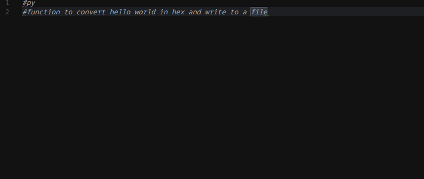

  

# Collama

**AI-powered code completion and editing for VS Code using local Ollama models**

<!-- [![Version]](https://img.shields.io/github/v/release/bitdruid/collama?label=version) -->

[Features](#features) • [Installation](#installation) • [Configuration](#configuration) • [Models](#models) • [Contributing](#contributing)

  

---

## Overview

Collama is a VS Code extension that uses [Ollama](https://ollama.com) models to get code completions, refactoring suggestions, and documentation generation — all running privately on your machine with no external API calls.

> **Status:** This project is in heavy active development. For sure there will be a lot of strange output. If you have any ideas to improve the quality just let me know and contribute!

## Features

✨ **Code Completion**
- Inline, multiline, and multiblock (more a "fun" feature) suggestions
- uses currently opened tabs as context

🔧 **Code Edits**
- Generate docstrings and documentation
- Extract functions and refactor code
- Simplify complex code
- Fix syntax errors
- Manual instructions

💬 **Chat Interface**
- Under construction

## Quick Start

### Prerequisites

- **VS Code** 1.107.0 or higher
- **Ollama** running locally (or accessible on your network)
- A supported code model (see [Models](#models))

## Installation

Use the marketplace to install the extension or build the vsix yourself. Furthermore you need an `ollama` instance in your local network. 
See [this link how to install ollama](https://docs.ollama.com/quickstart) or [this link for the docker image](https://ollama.com/blog/ollama-is-now-available-as-an-official-docker-image).

## Configuration

Configure Collama via VS Code Settings (Preferences → Settings, search "collama"):

| Setting                       | Type    | Default                     | Description                                              |
| ----------------------------- | ------- | --------------------------- | -------------------------------------------------------- |
| `collama.apiEndpoint`         | string  | `http://127.0.0.1:11434`    | Ollama API endpoint (IP/domain + port)                   |
| `collama.apiCompletionModel`  | string  | `qwen2.5-coder:3b`          | Model for code completions                               |
| `collama.apiInstructionModel` | string  | `qwen2.5-coder:3b-instruct` | Model for code edits (use instruct/base variant)         |
| `collama.autoComplete`        | boolean | `true`                      | Enable auto-suggestions                                  |
| `collama.suggestMode`         | string  | `inline`                    | Suggestion style: `inline`, `multiline`, or `multiblock` |
| `collama.suggestDelay`        | number  | `1500`                      | Delay (ms) before requesting completion                  |

## Models

### Recommended Models

Collama is tested primarily with the **Qwen Coder** series and performs best with specialized code models:

#### For Code Completion (FIM - Fill In Middle)
- **qwen2.5-coder:3b** ⭐ (default)
- **qwen2.5-coder:7b** (better quality, higher latency)

#### For Code Edits (Instruct/Base Models)
- **qwen2.5-coder:3b-instruct** ⭐ (default)
- **gpt-oss:20b** (recommended for complex edits, higher latency)

### Model Compatibility Table

| Model         | Tested Sizes | FIM Support | Status   | Notes                                    |
| ------------- | ------------ | ----------- | -------- | ---------------------------------------- |
| qwen2.5-coder | 1.5B, 3B, 7B | ✅           | Stable   | Recommended for most use cases           |
| qwen3-coder   | 30B          | ✅           | Stable   | Excellent quality, higher resource usage |
| starcoder     | —            | ⚠️           | Untested | May work; contributions welcome          |
| starcoder2    | 3B           | ✅           | Stable   | Improved over v1                         |
| codellama     | 7B, 13B      | ⚠️           | Limited  | Limited file context support; FIM is ok  |
| codeqwen      | —            | ⚠️           | Untested | May work; contributions welcome          |

> 💡 Models are tested primarily with **quantization level q4**. Results may vary with other quantization levels.

> 🤔 **Note:** ChatML format is not supported - that means only true fim-models will work for autocomplete!

## Usage

### Code Completion

1. **Trigger Completion**: Use `editor.action.inlineSuggest.trigger` (default keybinding varies by OS)
   - Set custom keybinding: `Alt + S` or `Ctrl + NumPad 1` (example)
2. **Auto-Trigger**: Completions trigger automatically after 1.5 seconds of inactivity (configurable via `suggestDelay`)
3. **Accept**: Press `Tab` to accept suggestion, `Esc` to dismiss

### Code Edits (not that much tested)

1. Select code in the editor
2. Right-click → **collama (on selection)** and choose:
   - **Write Docstring** - Generate documentation
   - **Extract Functions** - Refactor into separate functions
   - **Simplify Code** - Improve readability and efficiency
   - **Fix Syntax** - Correct syntax errors
   - **Edit (manual)** - Custom AI-assisted edits

### Chat Interface

This is under construction and will be available in the long run...

## Contributing

Contributions are welcome! Here's how you can help:

1. **Report Issues** [Open an issue](https://github.com/bitdruid/collama/issues)
2. **Submit PRs**: Fork, create a feature branch, and submit a pull request
